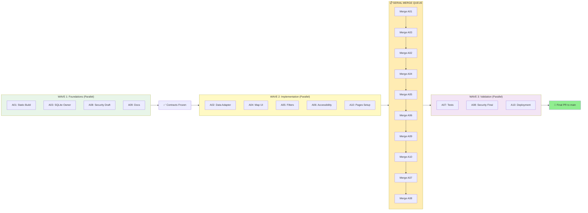
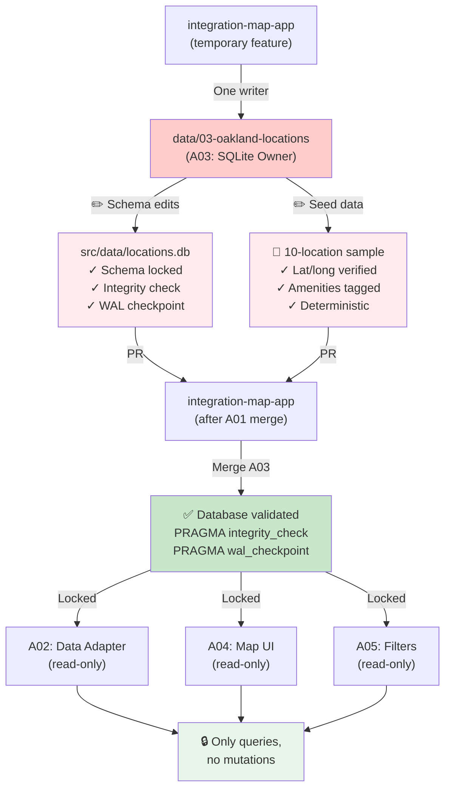
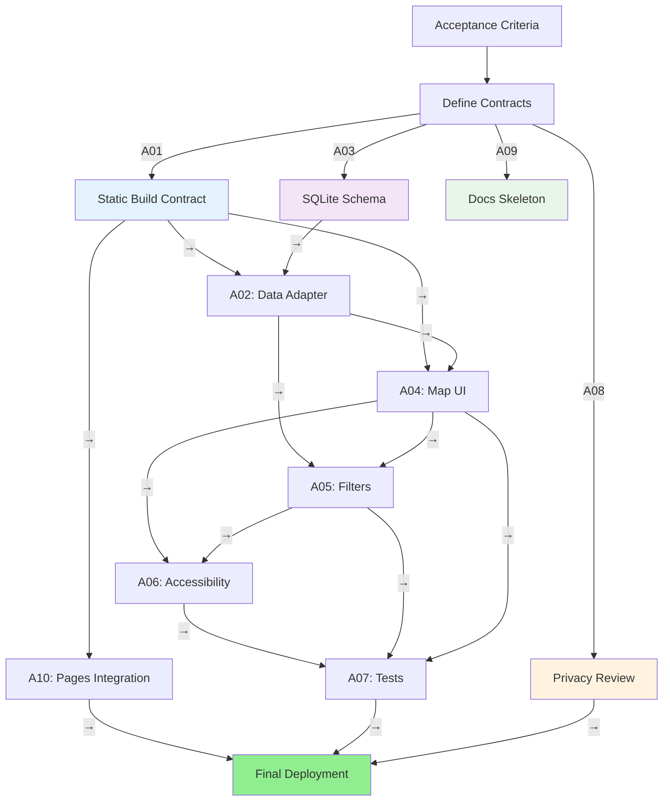
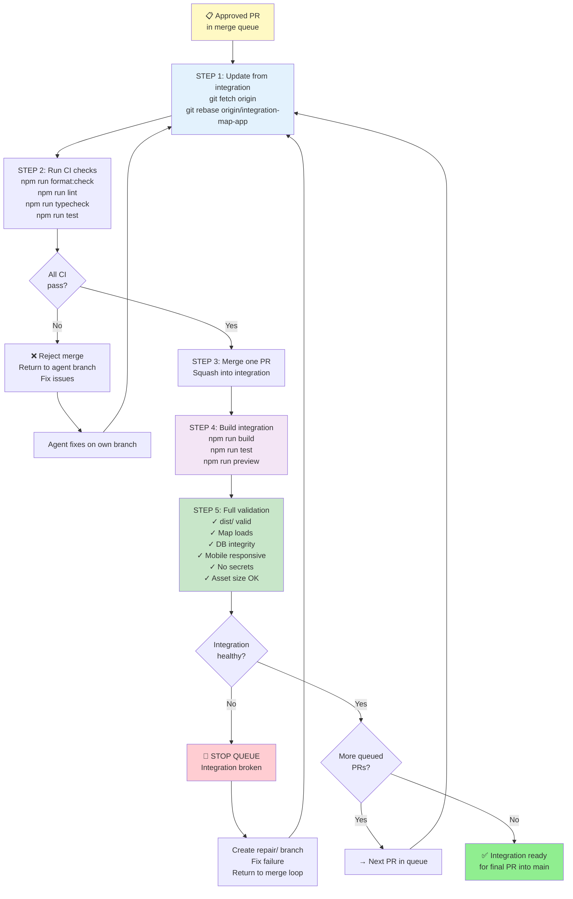

# Swarm Orchestration Flowchart

## Main Orchestration Flow

```mermaid
flowchart TD
    START["🚀 Coordinator: Setup<br/>integration-map-app branch"] --> WAVE1["⏱️ WAVE 1: Foundations<br/>A01, A03, A08, A09<br/>(Parallel 2h)"]
    
    WAVE1 --> A01["A01: Static Build Contract<br/>vite.config.js, dist/ output<br/>npm run build passing"]
    WAVE1 --> A03["A03: SQLite Schema & Seed<br/>locations.db schema<br/>10-location seed data"]
    WAVE1 --> A08["A08: Security Draft<br/>CSP rules, dependency audit<br/>SECURITY.md"]
    WAVE1 --> A09["A09: Docs Skeleton<br/>README template<br/>docs/ structure"]
    
    A01 --> FREEZE{"Coordinator:<br/>Freeze Contracts?"}
    A03 --> FREEZE
    A08 --> FREEZE
    A09 --> FREEZE
    
    FREEZE -->|Yes| FREEZE_GATE["✅ Contracts Locked<br/>UI boundaries defined<br/>Data shape frozen<br/>Dependencies locked"]
    FREEZE -->|No| REPAIR_W1["🔧 Repair Wave 1<br/>Create repair/ branch<br/>Fix failures"]
    REPAIR_W1 --> FREEZE
    
    FREEZE_GATE --> WAVE2["⏱️ WAVE 2: Implementation<br/>A02, A04, A05, A06, A10<br/>(Parallel 4h)"]
    
    WAVE2 --> A02["A02: Data Adapter<br/>Location queries<br/>Geolocation handling"]
    WAVE2 --> A04["A04: Map Shell<br/>MapLibre integration<br/>Marker rendering"]
    WAVE2 --> A05["A05: Filters & Details<br/>Filter controls<br/>Location cards"]
    WAVE2 --> A06["A06: Accessibility<br/>Keyboard navigation<br/>ARIA labels"]
    WAVE2 --> A10["A10: Pages Integration<br/>GitHub Actions workflow<br/>Deployment verification"]
    
    A02 --> PR02["PR: agent/02-data-reader<br/>→ integration-map-app"]
    A04 --> PR04["PR: agent/04-map-shell<br/>→ integration-map-app"]
    A05 --> PR05["PR: agent/05-filter-details<br/>→ integration-map-app"]
    A06 --> PR06["PR: agent/06-accessibility<br/>→ integration-map-app"]
    A10 --> PR10["PR: agent/10-pages-integration<br/>→ integration-map-app"]
    
    PR02 --> QUEUE["📋 Serial Merge Queue<br/>(Dependency order)<br/>1. A01 2. A03 3. A02<br/>4. A04 5. A05 6. A06<br/>7. A09 8. A10"]
    PR04 --> QUEUE
    PR05 --> QUEUE
    PR06 --> QUEUE
    PR10 --> QUEUE
    
    QUEUE --> MERGE_LOOP{"Merge one PR?"}
    
    MERGE_LOOP -->|Yes| MERGE_STEP["✅ Merge PR into integration"]
    MERGE_STEP --> VALIDATE["🧪 Integrated Validation<br/>• npm run build<br/>• npm run test<br/>• Map loads<br/>• DB integrity<br/>• Mobile responsive"]
    
    VALIDATE --> VALIDATE_CHECK{"All checks<br/>pass?"}
    
    VALIDATE_CHECK -->|No| REPAIR_W2["🔧 Repair Wave 2<br/>Create repair/ branch<br/>Fix integration issue"]
    REPAIR_W2 --> MERGE_STEP
    
    VALIDATE_CHECK -->|Yes| MORE_PRS{"More queued<br/>PRs?"}
    
    MORE_PRS -->|Yes| MERGE_LOOP
    MORE_PRS -->|No| WAVE3["⏱️ WAVE 3: Validation<br/>A07, A08, A10<br/>(Parallel 2h)"]
    
    WAVE3 --> A07["A07: Full Test Suite<br/>E2E tests<br/>Performance benchmarks"]
    WAVE3 --> A08_FINAL["A08: Final Security<br/>Vulnerability scan<br/>CSP validation"]
    WAVE3 --> A10_FINAL["A10: Deployment Check<br/>Pages artifact loads<br/>All routes resolve"]
    
    A07 --> FINAL_CHECK{"Final Integration<br/>Complete?"}
    A08_FINAL --> FINAL_CHECK
    A10_FINAL --> FINAL_CHECK
    
    FINAL_CHECK -->|No| REPAIR_W3["🔧 Repair Wave 3<br/>Create repair/ branch"]
    REPAIR_W3 --> MERGE_STEP
    
    FINAL_CHECK -->|Yes| FINAL_PR["📤 Final PR<br/>integration-map-app → main<br/>With full validation report"]
    
    FINAL_PR --> REVIEW["👥 Human Review<br/>Code review checks<br/>Required CI passed"]
    
    REVIEW --> APPROVED{"PR Approved?"}
    
    APPROVED -->|No| FEEDBACK["📝 Feedback<br/>Return to owning agent<br/>or repair branch"]
    FEEDBACK --> MERGE_STEP
    
    APPROVED -->|Yes| MERGE_MAIN["🎯 Merge into main<br/>Squash or merge commit"]
    
    MERGE_MAIN --> DEPLOY["🚀 GitHub Actions Deploy<br/>• npm install<br/>• npm run build<br/>• Deploy dist/ to Pages<br/>• Verify plug.vln.gg"]
    
    DEPLOY --> VERIFY["✅ Production Live<br/>plug.vln.gg live<br/>All features working"]
    
    VERIFY --> CLEANUP["🧹 Cleanup<br/>Delete temp branches<br/>• integration-map-app<br/>• agent/* branches<br/>• repair/* branches"]
    
    CLEANUP --> END["✨ Release Complete"]
    
    style START fill:#e8f4f8
    style FREEZE_GATE fill:#d4edda
    style QUEUE fill:#fff3cd
    style FINAL_PR fill:#e7d4f5
    style MERGE_MAIN fill:#90ee90
    style DEPLOY fill:#87ceeb
    style END fill:#ffd700
```

---

## Agent Parallel Workflow

---

## SQLite Single-Writer Pattern

---

## Dependency Wave Graph

---

## Merge Queue Validation Loop

