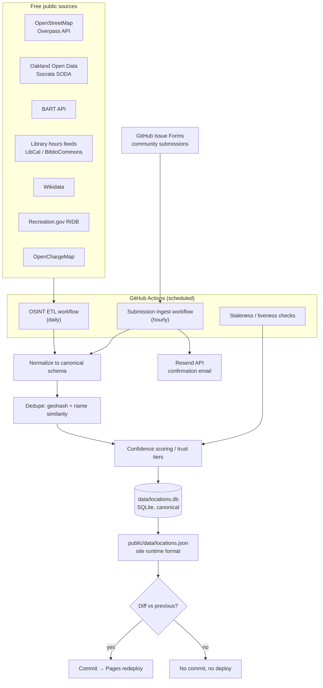

# Data Pipeline Plan — Community Data Pipeline (v2.1.0)

**Project:** PLUG — Privacy-first device charging location map for vulnerable populations
**Status:** Planned (target milestone: v2.1.0)
**Depends on:** v2.0.0 static site (React/Vite map app + landing page, live at plug.vln.gg)
**Related research:** [OSINT Research Plan — Oakland Electrical Infrastructure](../05-development/osint-oakland-electrical-sources.md)

---

## 1. Objectives

1. **Automate location discovery.** Replace hand-maintained seed data with a scheduled OSINT ETL pipeline that continuously discovers, refreshes, and retires Oakland charging-friendly venues from free public sources.
2. **Accept community input safely.** Open a structured, moderated submission channel with zero backend, using GitHub Issue Forms as the queue.
3. **Stay honest about confidence.** Publish only what the evidence supports, label automated entries clearly, and demote listings automatically when signals go stale.
4. **Preserve the core constraints.** No servers, no accounts, no tracking. Everything runs inside GitHub Actions and ships as static files to GitHub Pages. Zero hosting cost.

**Non-goals:** real-time availability, user accounts, client-side API calls to third parties, any storage of personal data in the repository.

---

## 2. Architecture Overview

The pipeline is a set of scheduled GitHub Actions workflows. All state lives in the repository: a canonical SQLite database plus a derived JSON file the site consumes. A commit only happens when the data actually changed, which is what triggers a Pages redeploy. Git history doubles as a full backup and audit trail.

**Key properties:**

- **Commit-on-diff.** Workflows compare regenerated output to the committed version and only commit when something changed. This keeps history meaningful and avoids pointless redeploys.
- **SQLite is canonical; JSON is derived.** `data/locations.db` is the source of truth. `public/data/locations.json` is generated from it in the exact shape the site expects. Neither is hand-edited.
- **Honest inference boundary.** OSINT reliably confirms that a venue exists, its category, and its hours. It does **not** confirm outlet availability — that is an inference from category priors (libraries and cafes usually have accessible outlets; a bus stop does not). Automated entries are therefore labeled as such rather than presented as verified.

---

## 3. Data Sources

| Source | Access | Cadence | What it provides | Outlet signal |
|---|---|---|---|---|
| OpenStreetMap (Overpass API) | Free, rate-etiquette applies | Daily | Venues tagged `amenity=library`/`cafe`/`fast_food`/`community_centre`, `device_charging_station`, `power_supply`, `opening_hours` | Inferred from category; `power_supply`/`device_charging_station` tags are near-confirmations |
| City of Oakland open data portal | Socrata SODA API, free | Daily | Public facilities, parks, libraries, community centers | Inferred |
| BART API | Free | Daily | Station locations, hours | Inferred (stations commonly have outlets; still labeled inferred) |
| Library hours feeds (LibCal / BiblioCommons) | Free/public | Daily | Machine-readable open hours for library systems | Hours corroboration only |
| Wikidata | Free SPARQL | Daily | Venue identity cross-references, coordinates | Corroboration only |
| Recreation.gov RIDB | Free API | Daily | Public recreation facilities | Inferred |
| OpenChargeMap | Free API | Daily | Charging infrastructure points | Strong signal for EV-adjacent public power; still device-charging inference |
| Community submissions (GitHub Issue Forms) | Free | Hourly | First-hand reports, corrections, outlet confirmations | Reported (human claim, pending corroboration) |

Detailed source evaluation, query strategies, and licensing notes for the OSINT sources live in the existing [OSINT research plan](../05-development/osint-oakland-electrical-sources.md); this document does not duplicate them.

---

## 4. Canonical Schema

Two tables. Venues describe places; evidence describes observations about places. **The publish tier of a venue is always derived from its evidence rows — it is never hand-edited.**

### `venues`

| Column | Type | Notes |
|---|---|---|
| `id` | TEXT PK | Stable, deterministic (e.g. geohash + slug) |
| `name` | TEXT | Display name |
| `lat`, `lon` | REAL | WGS84 |
| `category` | TEXT | library, cafe, fast_food, community_centre, transit, other |
| `indoor` | INTEGER | Boolean |
| `access_policy` | TEXT | `public` \| `customer` \| `patron` |
| `opening_hours` | TEXT | OSM `opening_hours` syntax where available |
| `address` | TEXT | Normalized street address |
| `first_seen` | TEXT | ISO 8601 |
| `last_seen` | TEXT | ISO 8601, refreshed each run the venue is observed |

### `evidence`

| Column | Type | Notes |
|---|---|---|
| `venue_id` | TEXT FK | References `venues.id` |
| `source` | TEXT | `osm` \| `socrata` \| `bart` \| `hours_feed` \| `submission` \| `field_check` |
| `observed_at` | TEXT | ISO 8601 |
| `outlet_claim` | TEXT | `confirmed` \| `inferred` \| `reported` |
| `payload_json` | TEXT | Raw normalized record for audit/debugging |

### Deduplication

Candidate records are merged when they fall in the same (or adjacent) geohash cell **and** clear a name-similarity threshold (normalized token comparison). Merged records accumulate evidence rows rather than overwriting each other — corroboration is the whole point.

---

## 5. Trust Model

### Publish tiers and badges

The site currently shows three badges: **Verified**, **Community report**, and **Needs recheck**. The pipeline adds a fourth: **Auto-listed**.

| Badge | Meaning | How it is earned |
|---|---|---|
| Verified | A human field check confirmed outlets | `field_check` evidence with `outlet_claim=confirmed` |
| Auto-listed | Machine-corroborated venue; outlets inferred from category | Auto-publish rule below |
| Community report | A person reported it; not yet corroborated | `submission` evidence only |
| Needs recheck | Signals have gone stale or contradictory | Staleness automation below |

### Auto-publish rule

A venue is auto-published (as **Auto-listed**) only when **all** of the following hold:

1. **Corroboration:** at least 2 independent sources report the venue.
2. **Hours:** machine-readable opening hours are available from at least one source.
3. **Category prior:** the venue category's outlet-likelihood prior clears the configured threshold.

Anything short of that stays in the database but off the map (or appears as Community report if it came from a submission).

### Staleness automation (auto-demotion)

A published venue is automatically demoted to **Needs recheck** when any of:

- the venue disappears from OSM (present in previous extract, absent now);
- its hours feed changes materially (hours removed, or venue marked closed);
- a periodic liveness check of the venue's website fails.

Demotion is just another derived-tier computation — no manual edits, and the evidence trail explains every transition.

---

## 6. Community Submissions Flow

GitHub Issue Forms serve as the entire submission queue: structured input via a YAML form template, spam defense and moderation via GitHub's existing account requirements and label system, at zero cost.

1. **Entry point.** The static site deep-links to a pre-filled GitHub Issue Form (location name, coordinates, category, notes). Submitting requires a GitHub account, which is the first spam filter.
2. **Queue.** New submissions carry the `submission` label. Maintainers can triage, close spam, or leave them for automation.
3. **Hourly ingest.** A scheduled workflow parses open `submission`-labeled issues and, for each one:
   - validates the parsed fields against a JSON Schema;
   - geofences coordinates to the Oakland service area;
   - rejects coordinates that resolve to residential buildings;
   - sanitizes **all** free-text fields — the ingest step is the XSS boundary, because the static site renders this content with no server between attacker and visitor;
   - writes the record as `submission` evidence (`outlet_claim=reported`);
   - labels the issue `ingested`.
4. **Publication.** Submission evidence participates in the trust model like any other source. A submission alone yields at most a Community report badge; it can also serve as one of the two corroborating sources for auto-publish.

---

## 7. Email Flow (Resend)

Resend's free tier (3,000 emails/month, 100/day) covers submission confirmations and an optional updates list — with hard privacy rules:

- **Server-side only.** The Resend API is called exclusively from GitHub Actions using a repository secret. The API key must never ship in client-side code, where it would be exposed to every visitor.
- **Confirmations.** After ingest, the workflow sends the submitter a confirmation email (when they provided an address in the form).
- **Double opt-in without a backend.** Confirmation emails use reply-to-confirm: the recipient replies to confirm, and the workflow treats the reply as opt-in. No web endpoint required.
- **No emails in the repo — ever.** Opt-in contacts are stored **only** in Resend Audiences. Email addresses must never be committed to the public repository; if deduplication requires tracking prior submitters, store salted hashes only.
- **Separate consent for updates.** The optional project-updates list requires its own explicit consent, distinct from submission confirmations, to comply with CAN-SPAM and CCPA. Every list message includes unsubscribe handling via Resend.

---

## 8. Risks and Constraints

| Risk / constraint | Impact | Mitigation |
|---|---|---|
| GitHub scheduled workflows drift 15–60 min from their cron time | Ingest and ETL runs are approximate, not punctual | Acceptable for daily/hourly cadences; nothing in the design needs punctuality |
| GitHub auto-disables scheduled workflows after 60 days of repo inactivity | Pipeline silently stops | Commit-on-diff activity largely self-heals; add an explicit keepalive commit/workflow as backstop |
| Overpass API etiquette | Hammering Overpass risks rate-limiting or bans | OSINT ETL runs daily, not hourly; single consolidated query per run; identify with a proper User-Agent |
| OSM data is ODbL-licensed | Legal obligation: attribution and share-alike for the derived database | Add a `LICENSE-DATA` note covering the derived DB, plus OSM attribution in the site footer (Phase E) |
| Data poisoning via submissions | Malicious/false locations, XSS payloads, out-of-area spam | JSON Schema validation, service-area geofence, residential-coordinate rejection, free-text sanitization at ingest, label-based moderation, trust tiers requiring corroboration |
| API key exposure | Resend key abuse | Key lives only in repo secrets; all sends from Actions; never client-side |
| Personal data leakage | Emails in a public repo are unrecoverable | Contacts only in Resend Audiences; hashes if dedupe is needed; enforced in code review |
| Overclaiming outlet availability | Users travel to a venue with no accessible outlet | `outlet_claim` taxonomy, Auto-listed badge wording, category priors kept conservative |

---

## 9. Phased Rollout (Milestone v2.1.0)

Each phase ships independently and is useful on its own.

### Phase A — OSINT ETL + Auto-listed badge

Daily workflow fetching all OSINT sources, normalization, dedupe, confidence scoring, SQLite + JSON generation, commit-on-diff.

**Acceptance criteria:**
- Daily workflow runs green and commits only when data changed.
- `data/locations.db` and `public/data/locations.json` are generated, never hand-edited.
- Auto-publish rule enforced (2+ sources, machine-readable hours, category prior).
- Auto-listed badge renders on the site with honest "outlets inferred" wording.

### Phase B — Community submissions

Issue Form template, hourly ingest workflow, site deep-link to the pre-filled form.

**Acceptance criteria:**
- Submissions validate against JSON Schema; invalid submissions get a labeled, commented rejection.
- Geofence and residential-coordinate rejection demonstrably block out-of-scope input.
- All free text is sanitized before it can reach `locations.json`.
- Processed issues are labeled `ingested`; evidence rows carry `outlet_claim=reported`.

### Phase C — Resend confirmations + opt-in

Confirmation emails from the ingest workflow; reply-to-confirm double opt-in; Resend Audiences for the updates list.

**Acceptance criteria:**
- Confirmation sends stay within free-tier limits (100/day) with graceful backoff.
- No email address appears anywhere in the repository or workflow logs.
- Updates-list membership requires separate explicit consent and supports unsubscribe.

### Phase D — Staleness and liveness automation

OSM-disappearance detection, hours-feed change detection, website liveness checks, auto-demotion to Needs recheck.

**Acceptance criteria:**
- A venue removed from OSM is demoted on the next daily run.
- Demotions are visible in git history with the triggering evidence.
- No demotion ever requires a manual database edit.

### Phase E — Licensing, attribution, privacy

ODbL compliance and policy updates.

**Acceptance criteria:**
- `LICENSE-DATA` documents the ODbL share-alike terms for the derived database.
- Site footer attributes OpenStreetMap contributors (and other sources as required).
- Privacy policy updated to cover submissions, email handling, and Resend Audiences.

---

**[← Back to Project Scope](README.md)** | **[Roadmap](roadmap.md)** | **[OSINT Research](../05-development/osint-oakland-electrical-sources.md)**
